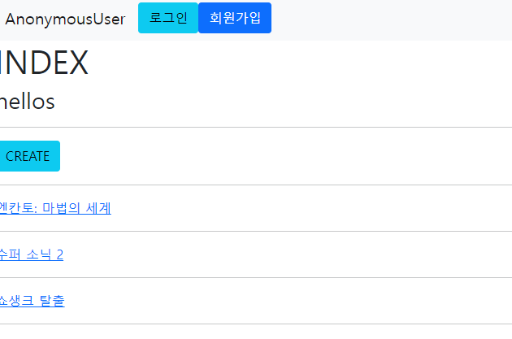
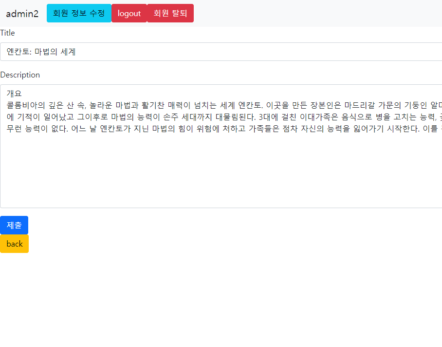
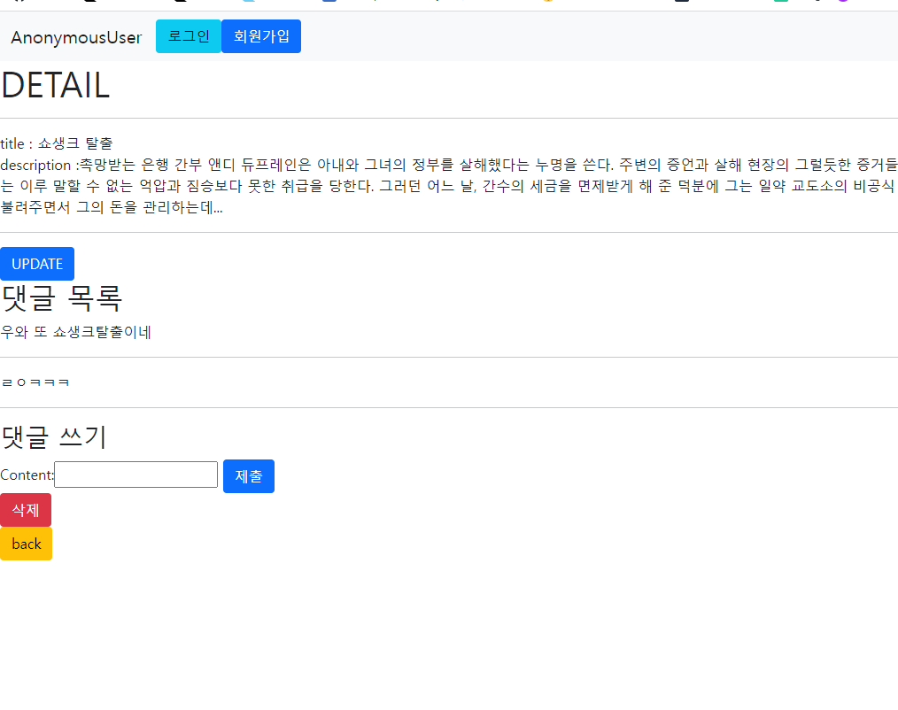
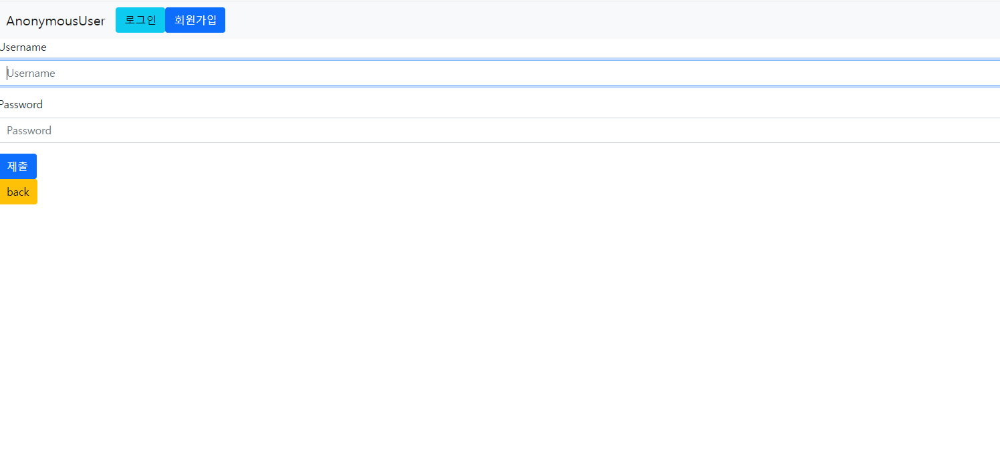
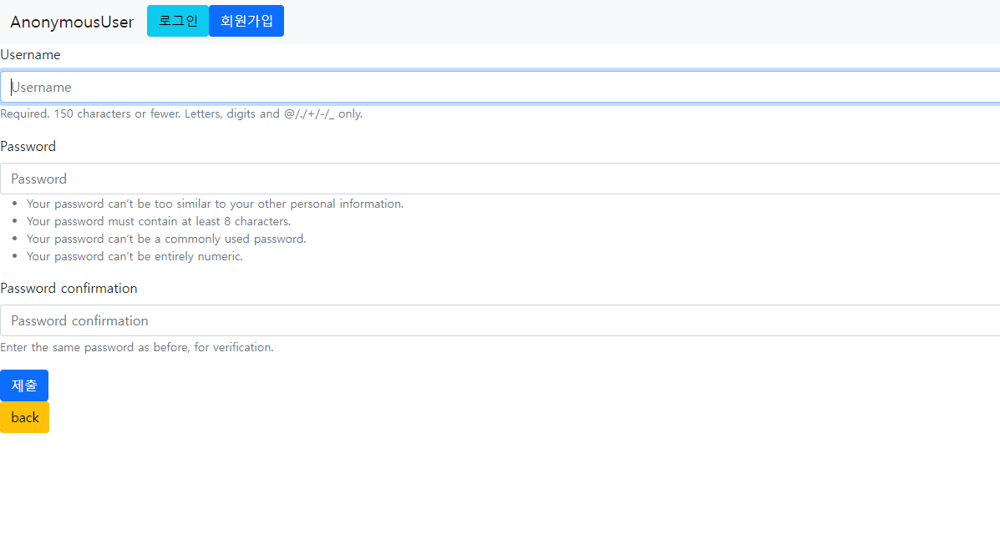
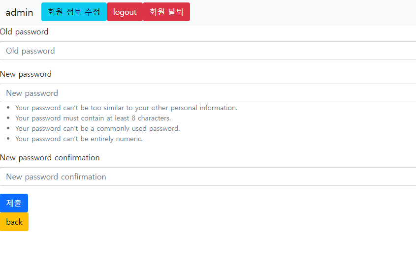

# PTJ 07


<div style="text-align: right"> 대전_3반_김동완</div>

## 이번 ptj를 통해 배운 내용

1. CRUD를 활용한 Web application 제작
1. ORM을 이용한 데이터 활용
1. Django ModelForm을 활용한 사용자 요청 데이터 유효성 검증 
1. Django Authentication System 사용
1. Database many to one relationship(1:N)에 대한 이해

### 개발도구

- Visual Studio Code
- Google Chrome Browser
- Bootstrap v5
- Django 3.2+
- 

### 요구사항 

- django 프로젝트 이름은 pjt07, 앱 이름은 movies와 accounts로 지정합니다.
  커뮤니티 서비스의 게시판 기능 개발을 위한 단계로,
  해당 기능들은 향후 커뮤니티 서비스의 필수 기능으로 사용됩니다.
  아래 기술된 사항들은 필수적으로 구현해야 하는 내용입니다.

### 프로젝트 진행

##### 프로젝트는 전반적으로 기능을 구현하며 커밋을 진행했으므로, 커밋 순서에 따라서 진행을 서술하겠습니다.

다만, 협업 프로젝트를 하다보니 정신이 없어 일일히 진행과정을 캡처하지 못해, 최종 결과 캡처본을 첨부합니다.

### D: Driver, N : Navigator

### 1단계 : 기본 형식 만들기 (D:김동완, N:안용현)

#### basic setting 

- 기본적인 장고 세팅을 했습니다.
- 가상환경 설정, gitignore, 프로젝트 생성, 앱 등록, 템플릿(base.html) 만들기를 진행했습니다. 
- 또한, 2인 프로젝트이기 때문에 git push 및 pull에 이상이 없는지 확인했습니다. 

### Model 만들기

- ModelForm을 사용하려고, Move,Comment 모델을 먼저 생성했습니다.
- ERD명세서에 따라 CustomUser를 이용해서 user_id 변수를 FK로 받아 user를 상속받았습니다.

```python
class Movie(models.Model) :
    #user = models.ForeignKey(settings.AUTH_USER_MODEL,on_delete=models.CASCADE)
    title = models.CharField(max_length=20)
    description = models.TextField()


class Comment(models.Model) :
    #user = models.ForeignKey(settings.AUTH_USER_MODEL,on_delete=models.CASCADE)
    movie = models.ForeignKey(Movie,on_delete=models.CASCADE)
    content = models.CharField(max_length=100)
```

```python
from django.db import models
from django.contrib.auth.models import AbstractUser
# Create your models here.


class User(AbstractUser) :
    pass
```

### 2단계 : CRUD 구축하기

### Movie

#### INDEX 만들기(D:김동완, N:안용현)

- INDEX를 만들어서 기본 페이지가 잘 렌더링 되는지 확인하려 했습니다.
- 하지만, 이 과정에서 저번과 같이 base.html을 찾지 못하는 현상이 발생했습니다.
- 따라서, 오류를 디버깅 해본 결과 오타 문제였습니다.
  - 경로를 제대로 설정해줘서 문제를 해결할 수 있었습니다.



#### CREATE만들기(D:안용현,N:김동완)

- 이제 DB에 데이터를 추가하고 잘 나오는지 확인하고자 CREATE를 만들었습니다.
- CREATE를 만들때는 ModelForm을 사용했습니다.

```python
class MovieForm(forms.ModelForm):

    class Meta: 
        
        model = Movie
        exclude = ('user',)
```

- 이 과정에서 user를 아직 만들지 않아 user_id를 주기 어려운 문제가 발생해, models.py상에서 userid를 주석처리하고 다시 migrations를 햇습니다. 


#### UPDATE(D:안용현,N:김동완)

- CREATE를 만들고 데이터가 잘 INDEX에 표현되는지 확인 후 UPDATE를 곧바로 만들었습니다.
- CREATE와 유사한 형식이어서 instance만 넘겨주면 쉽게 해결할 수 있는 작업이었습니다.



### Conflict 발생

- 페어가 update를 개발하던 중 오류가 발생해 넘겨받았는데, 그 과정에서 sqllite3를 삭제하면서, conflict가 발생했습니다.
- 아마 원인이, 서버를 켜놓은 상태에서 push/pull을 해서 로컬과 리모트에 문제가 발생했던 것 같습니다.
- migration 삭제, 강제로 푸쉬등을 시도했는데 잘 되지 않았습니다. 
- 교수님의 도움을 받아 서로 다른 부분 중 최선의 것으로 merge를해서 해결할 수 있었습니다.

- 다시 돌아보면서 문제를 더 점검하고 해결방법을 알아봐야할 것 같습니다


#### Detail(D:김동완,N:안용현)

- detailview는 먼저 comment를 추가하지 않았고, image같은 요구가 없었기 때문에 간단히 DB의 데이터를 가져와서 표시했습니다.
- 추후 Comment기능을 추가하는 과정에서, pk를 넘겨줄 때 2개의 pk가 아닌 1개의 pk만 넘기는 경우, Commit을 하지 않는 경우 등 오류가 있어 조금 해맸지만 금방 해결할 수 있었습니다. 




### Account

#### Login/Logout(D:안용현,N:김동완)

- 로그인폼과 로그인 기능은 Django에서 대부분 잘 제공을 해주기 때문에 어렵지 않게 만들었던 것 같습니다. 

- AuthenticationForm을 이용했고, 장고 내장 모델을 이용해서 구현했습니다. 

- DB에 변동사항을 줄 때 사용해야하는 POST를 가끔 놓쳐서 오류가 발생했지만 금방 해결했습니다.

  



#### SIGNUP/UPDATE(D:안용현,N:김동완)

- Signup과 UPDATE는 장고 기본 Form을 사용했는데, 혹시 추후에 다른 정보를 필수적으로 받을 수 있기 때문에 Custom을 해서 진행했습니다.
- 대부분 loginform을 만들면 signup,update는 간단히 만들어지기 때문에 어렵지 않게 만들었습니다. 
- 하지만 세부적인 과정에서 instance를 request.user로 받는다거나, request.POST를 먼저 받는 등 다른 모델과 데이터를 받는 형식에 약간 차이가 있는 것 같아 세부내용을 적용하는 것이 쉽지 않았습니다.
- 

#### 

#### Password_Change/DELETE 구현 (D:김동완,N:안용현)

- password 변경의 경우 장고에서 권장하는 url이 있기 대문에 그를 따랐고, 변경 후 재로그인은 사용자의 캐시를 삭제하지 않기 위해 update_session_auth_hash를 사용해서 진행했습니다.
- 명세서를 보고 먼저 Templates가 직접 render될 화면을 먼저 만들려 해서, 삭제는 가장 나중에 구현했습니다.
- comment_delete 과정에서 Pk를 받을 때 조금 애먹었던 기억이 나고, url이 복잡해지니 생각이 잘 안되서 힘들었던 것 같습니다. 이전 프로젝트를 참고해서 수정했습니다.
- 게시글과 회원정보를 삭제하는 것은 데코레이터를 사용하지 않아서 POST에 대해 조건분기로 처리를 햇습니다.



### 3단계 : 세부세팅하기

#### Navbar(D:김동완,N:안용현)

로그인이나 로그아웃, 회원 탈퇴 과정에서 POST로 접근해야하는 것도 있고, 일일이 URL로 들어가기 조금 번거로워서 navigation바를 user_authenticate에 따라 분기처리하고, 명세서에 따라 표현되게 구현했습니다.


#### userid 반영 및 인증권한 설정 

- 기본적인 세팅이 다 끝났기 때문에, 이제 user를 구분해서 접근/수정/삭제 권한을 부여했습니다.
- 대부분의 경우에는 데코레이터를 사용했고, next파라미터 이슈가 발생하는 경우 login_require는 조건문으로 설정했습니다.
- 이 과정에서 로그인 한 회원만 본인이 작성한 영화 게시글을 작성, 수정 및 삭제할 수 있도록 조정했습니다.
- 또한, 로그인 한 회원만 본인이 작성한 댓글을 작성 및 삭제할 수 있습니다.


#### bootstrap

- 부트스트랩 설정으로 인해 좀 더 가독성 있게 페이지를 만들 수 있다고 생각하여, bootstrap을 적용하고자 했습니다.
- 하지만, django-bootstrap5를 설치 후에 settings.py에 적용되지 않는 문제가 발생했고, 교수님께 질문한 결과 django-bootstrap-v5로 설치해 문제를 해결할 수 있었습니다.

- 네비게이션은 bootstrap 모델을 가져와 유저 로그인 인증 조건으로 다른 페이지가 표시되게 했고, 버튼은 기본 부트스트랩 CSS로 적용했습니다.
- form의 경우 부트스트랩 form을 사용해서 좀 더 깔끔히 표시되게 진행했습니다.


### 느낀점

- 페어프로그래밍을 통해 서로 의견을 나누면서, 프로그래밍을 하니 내가 아는 것에 대해서 좀 더확실히 설명할 수 있는 사람이 되어야겠다고 생각했습니다.
- git branch를 사용하지 않았지만 여러 오류가 발생해서, git에 대한 높은 이해를 가져야겠다고 생각했습니다.
- 관계형 데이터베이스에 대한 실전이해를 할 수 있어서 좋았습니다.